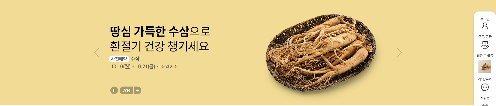

# hansalim

<h1>한살림 장보기 :: 지구를 살리는 뜻깊은 생활실천, 한살림</h1>  

jquery를 사용하지 않고 자바스크립트만으로 작업 예정
  
 
  <h3>click이벤트</h3>
  

  let infoMenu = document.querySelector(".info-menu-btn");
  let infoMenuShow = document.querySelector(".info-menu-deth2");
  infoMenu.onclick = function () {
    infoMenuShow.classList.toggle("click");
  };
  

  <h3>헤더 픽스, 스크롤 이벤트</h3>
  

    window.addEventListener("scroll", () => {
    let temp = window.scrollY;
    if (temp > 50) {
      document.querySelector(".header-bottom").classList.add("fixed");
    } else {
      document.querySelector(".header-bottom").classList.remove("fixed");
    }
  });
  

  <h3>fetch호출</h3>  
  

  fetch("json/gnb.json")
    .then((res) => res.json())
    .then((data) => {
      // console.log(data);
      let html = "";
      for (let i = 0; i < data.length; i++) {
        let obj = data[i];
        // console.log(obj);
        let objSub = data[i].submenu;
        // console.log("objSub", objSub);
        // console.log("objSub.length", objSub.length);
        if (objSub !== undefined) {
          html += `
            <!-- <li> -->
            <!-- <a href=${obj.link}>${obj.title}</a> -->
            <!-- <ul class="all-menu-sublist"> -->
            `;

          for (let j = 0; j < objSub.length; j++) {
            let subObj = objSub[j];
            // console.log(subObj);
            html += `
                  <li><a href="${subObj.sublink}">${subObj.subtitle}</a></li>
                  `;
          }
          html += `</ul>

          </li>`;
        }
      }
      html += "";
      // console.log("완료 : ", html);
      document.querySelector(".all-menu-list").innerHTML = html;
    })
    .catch((err) => console.log(err));

<h2>비주얼</h2>

 fetch("json/visual.json")
    .then((res) => res.json())
    .then((data) => {
      let html = "";
      data.forEach((element) => {
        html += `
        <!-- 

 -->
        `;
      });
      html += "";
      document.getElementById("sw-visual").innerHTML = html;
      let swVisual = new Swiper(".sw-visual", {
        loop: true,
        autoplay: {
          delay: 5000,
          disableOnInteraction: false,
        },
        pagination: {
          el: ".sw-visual-pg",
          type: "fraction",
        },
        navigation: {
          nextEl: ".sw-visual-next",
          prevEl: ".sw-visual-prev",
        },
      });

      let slideNow = "ing";
      let swVisualPlay = document.querySelector(".sw-visual-play");
      swVisualPlay.onclick = function () {
        if (slideNow == "ing") {
          slideNow = "stop";
          swVisual.autoplay.stop();
          swVisualPlay.classList.add("sw-visual-stop");
        } else {
          slideNow = "ing";
          swVisual.autoplay.start();
          swVisualPlay.classList.remove("sw-visual-stop");
        }
      };
    })
    .catch((err) => console.log(err));

